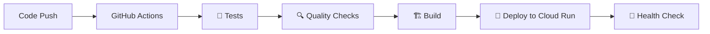

# 🚀 Production Deployment Guide - Best Practices

Bu rehber, kodunuzdaki değişiklikleri production ortamına güvenli ve otomatik bir şekilde nasıl deploy edeceğinizi gösterir.

## 🏗️ CI/CD Pipeline Mimarisi



## ⚙️ İlk Kurulum (One-time Setup)

### 1. 🔐 Google Cloud Service Account Oluşturma

```bash
# Service account oluştur
gcloud iam service-accounts create github-actions \
    --description="GitHub Actions deployment" \
    --display-name="GitHub Actions"

# Gerekli rolleri ver
gcloud projects add-iam-policy-binding $PROJECT_ID \
    --member="serviceAccount:github-actions@$PROJECT_ID.iam.gserviceaccount.com" \
    --role="roles/run.admin"

gcloud projects add-iam-policy-binding $PROJECT_ID \
    --member="serviceAccount:github-actions@$PROJECT_ID.iam.gserviceaccount.com" \
    --role="roles/storage.admin"

gcloud projects add-iam-policy-binding $PROJECT_ID \
    --member="serviceAccount:github-actions@$PROJECT_ID.iam.gserviceaccount.com" \
    --role="roles/iam.serviceAccountUser"

# Service account key oluştur
gcloud iam service-accounts keys create key.json \
    --iam-account=github-actions@$PROJECT_ID.iam.gserviceaccount.com
```

### 2. 🔑 GitHub Secrets Ayarlama

GitHub repository'nizde **Settings > Secrets and variables > Actions** kısmına gidin ve şu secret'ları ekleyin:

```bash
# Required secrets
GCP_PROJECT_ID=your-gcp-project-id
GCP_SA_KEY=<key.json dosyasının içeriğini buraya yapıştırın>
```

### 3. 📦 Secret Manager'da Production Secrets

```bash
# Production secret'larını oluştur
echo -n "your-production-database-url" | gcloud secrets create database-url --data-file=-
echo -n "your-super-secure-jwt-secret-min-32-chars" | gcloud secrets create jwt-secret --data-file=-
echo -n "your-hashing-secret-min-16-chars" | gcloud secrets create hashing-secret --data-file=-
```

## 🚀 Deployment Workflow

### Otomatik Deployment (Recommended)

1. **Code Change Yapın**
   ```bash
   git add .
   git commit -m "feat: add new feature"
   git push origin main
   ```

2. **GitHub Actions Otomatik Çalışır**
   - ✅ Tests run
   - ✅ Quality checks
   - ✅ Build & Deploy
   - ✅ Health check

### Manuel Deployment

GitHub Actions sekmesinde "🚀 Production Deployment" workflow'unu manuel olarak çalıştırabilirsiniz.

## 🔄 Development Workflow Best Practices

### Feature Branch Strategy

```bash
# 1. Feature branch oluştur
git checkout -b feature/new-social-feature

# 2. Değişiklikleri yap
# ... code changes ...

# 3. Test et
cargo test
cargo fmt
cargo clippy

# 4. Commit et
git add .
git commit -m "feat: implement social media feature"

# 5. Push et
git push origin feature/new-social-feature

# 6. Pull Request oluştur (GitHub UI'da)
# 7. PR merge olduğunda otomatik deploy olur
```

### 🏷️ Version Tagging (Advanced)

```bash
# Semantic versioning için tag oluştur
git tag -a v1.2.0 -m "Release version 1.2.0"
git push origin v1.2.0
```

## 🔍 Quality Gates

Pipeline'ımız şu kontrolleri yapar:

### 🧪 Test Stage
- Unit tests
- Integration tests
- Code formatting (`cargo fmt`)
- Linting (`cargo clippy`)

### 🏗️ Build Stage
- Production build
- Docker image creation
- Security scanning

### 🚀 Deploy Stage
- Cloud Run deployment
- Environment variable configuration
- Service URL generation

### 🏥 Post-Deploy
- Health check
- Smoke tests
- Performance monitoring

## 📊 Monitoring & Debugging

### Deployment Status Kontrol

```bash
# Service durumunu kontrol et
gcloud run services describe todo-api --region us-central1

# Logs'ları görüntüle
gcloud logs read --service=todo-api --limit=50
```

### GitHub Actions Debug

1. **Actions** sekmesine git
2. Failed job'ı tıkla
3. Log'ları incele
4. Error'ı tespit et ve düzelt

## 🔧 Pipeline Customization

### Environment-specific Deployments

```yaml
# staging ve production için farklı branch'ler
deploy-staging:
  if: github.ref == 'refs/heads/develop'
  # staging deployment logic

deploy-production:
  if: github.ref == 'refs/heads/main'
  # production deployment logic
```

### 🔒 Security Enhancements

```yaml
# Vulnerability scanning ekle
- name: 🔍 Security scan
  uses: securecodewarrior/github-action-add-sarif@v1
  with:
    sarif-file: security-scan.sarif
```

## 🚨 Rollback Strategy

### Hızlı Rollback

```bash
# Previous revision'a rollback
gcloud run services update-traffic todo-api \
  --to-revisions=PREVIOUS=100 \
  --region us-central1
```

### Database Migration Rollback

```bash
# Migration'ları geri al
sqlx migrate revert --database-url $DATABASE_URL
```

## 📈 Performance Monitoring

### Cloud Monitoring Setup

```bash
# Monitoring alert'leri oluştur
gcloud alpha monitoring policies create --policy-from-file=monitoring.yaml
```

### 📊 Metrics Tracking

- Response time
- Error rate
- Memory usage
- CPU utilization
- Request volume

## 🎯 Best Practices Özeti

### ✅ DO's
- ✅ Her değişiklik için test yaz
- ✅ Feature branch'ler kullan
- ✅ Semantic commit messages
- ✅ Secret'ları asla kod'a commit etme
- ✅ Health check endpoint'i kullan
- ✅ Monitoring ve logging aktif et

### ❌ DON'Ts
- ❌ Direkt main branch'e push etme
- ❌ Test'leri skip etme
- ❌ Secret'ları hard-code etme
- ❌ Production'da debug log'ları bırakma
- ❌ Migration'ları geri alınabilir yapmamak

## 🚀 Deployment Komutu (Manual Fallback)

Acil durumlar için manuel deployment:

```bash
# Local build ve deploy
docker build -f Dockerfile.production -t gcr.io/$PROJECT_ID/todo-api .
docker push gcr.io/$PROJECT_ID/todo-api
gcloud run deploy todo-api \
  --image gcr.io/$PROJECT_ID/todo-api \
  --region us-central1 \
  --allow-unauthenticated
```

Bu setup ile artık **git push** yapmanız yeterli! 🎉 Pipeline otomatik olarak:
1. Test'leri çalıştırır
2. Code quality check'leri yapar  
3. Production'a deploy eder
4. Health check yapar
5. Size deployment URL'ini verir

**Modern, güvenli ve otomatik deployment pipeline'ınız hazır!** 🚀